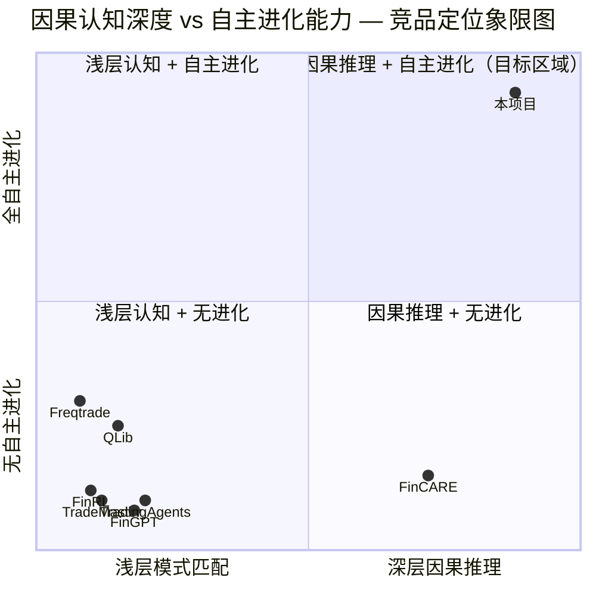

# 产品需求文档（PRD）

## 自主因果推理型加密永续合约进化 Agent

> **文档版本**：v1.0  
> **创建日期**：2026-08-06  
> **编写人**：产品经理 许清楚（Xu）  
> **文档状态**：待评审  
> **项目代号**：crypto_causal_agent

---

## 目录

- [1. 产品概述](#1-产品概述)
- [2. 用户故事](#2-用户故事)
- [3. 需求池（P0/P1/P2 分级）](#3-需求池p0p1p2-分级)
- [4. 竞品分析](#4-竞品分析)
- [5. Mermaid 象限图](#5-mermaid-象限图)
- [6. 市场定位分析](#6-市场定位分析)
- [7. 功能模块详细说明](#7-功能模块详细说明)
- [8. 非功能性需求](#8-非功能性需求)
- [9. 待确认问题](#9-待确认问题)

---

## 1. 产品概述

### 1.1 产品愿景与使命

**愿景**：构建业界最高智能度的加密永续合约自主进化 Agent，让 AI 像人类研究员一样"感知市场→理解因果→辩论推理→反事实推演→自主策略创新→自我复盘进化"，实现从"被动执行策略"到"主动创造策略"的范式跃迁。

**使命**：以纯离线仿真学术研究为定位，通过因果图谱推理替代浅层向量 RAG、多 Agent 辩论证伪推理、双层策略基因进化三大核心技术，系统性地解决传统交易 Agent 浅层拟合、缺乏因果认知、泛化能力差、智能度不足四大痛点，产出可运行工程 + 完整论文级实验数据 + 消融实验 + 进化对比报告。

### 1.2 核心价值主张

| 维度 | 传统交易 Agent | 本项目 |
|------|---------------|--------|
| **认知方式** | 浅层向量相似度匹配 | 因果图谱推理 + 多路融合召回 |
| **决策机制** | 单 Agent 线性推理 | 多 Agent 辩论 + 证伪校验 + 反事实推演 |
| **策略来源** | 人工预设指标/策略 | 零人工策略，Agent 自主创新策略基因 |
| **进化能力** | 参数网格搜索 | 双层基因进化（逻辑层+参数层）+ 对抗竞技场 |
| **泛化保障** | 单环境回测 | 四环境泛化沙箱 + 泛化惩罚机制 |
| **可解释性** | 黑盒模型输出 | 全链路因果可解释 + 三级复盘体系 |

### 1.3 目标用户画像

#### 画像一：AI 量化学术研究者
- **身份**：高校博士生/博士后，研究方向为 AI + 金融交叉领域
- **痛点**：现有框架（FinRL、QLib）缺乏因果推理能力，难以发表高水平论文；实验复现困难，消融实验不完整
- **需求**：完整的因果推理 Agent 工程 + 论文级实验数据 + 消融实验框架
- **使用场景**：运行进化实验→采集数据→撰写论文→发表顶会

#### 画像二：LLM Agent 研究者
- **身份**：AI 实验室研究员，关注 LangChain/LangGraph 多 Agent 编排
- **痛点**：缺乏复杂领域（金融交易）的多 Agent 辩论/证伪推理落地案例
- **需求**：可参考的多 Agent 辩论架构、反事实推演实现、工具调度方案
- **使用场景**：研究多 Agent 协作范式→复现架构→迁移到其他领域

#### 画像三：因果推理研究者
- **身份**：因果推断方向研究者，关注 do-calculus、反事实推理在时序数据中的应用
- **痛点**：因果推理在金融时序领域的应用缺乏完整工程实现
- **需求**：因果图谱构建、因果三元组抽取、反事实行情推演的完整实现
- **使用场景**：研究因果图谱在金融时序中的构建方法→验证因果推理对交易决策的提升

#### 画像四：进化计算研究者
- **身份**：进化算法/元学习方向研究者
- **痛点**：缺乏双层基因进化（逻辑层+参数层）在复杂策略空间中的验证
- **需求**：双层基因编码、遗传进化、对抗竞技场、知识蒸馏的完整实现
- **使用场景**：研究策略基因进化→对比不同进化策略→分析收敛性

#### 画像五：加密衍生品量化研究者
- **身份**：加密货币量化团队研究员
- **痛点**：现有加密交易机器人（Freqtrade、Hummingbot）策略固定，缺乏自主进化能力
- **需求**：高保真本地撮合仿真 + 永续合约特性模拟（资金费率、爆仓）
- **使用场景**：在仿真环境中验证策略→分析 Agent 进化轨迹→评估泛化能力

### 1.4 产品边界

#### ✅ 做什么（In Scope）

| 维度 | 范围 |
|------|------|
| **交易标的** | 币安 USDT 永续合约（本地仿真） |
| **数据来源** | 币安 K 线/深度数据、Glassnode 链上数据、FRED 宏观数据（历史离线数据） |
| **Agent 架构** | LangGraph 多 Agent 辩论 + 因果推理 + 反事实推演 |
| **进化机制** | 双层基因进化（逻辑+参数）+ 对抗竞技场 + 元学习 |
| **记忆系统** | 三层复合记忆（瞬时/案例向量/因果图谱） |
| **实验产出** | 消融实验、进化对比报告、论文级数据 |
| **运行环境** | 纯本地离线仿真，四环境沙箱 |

#### ❌ 不做什么（Out of Scope）

| 维度 | 排除原因 |
|------|---------|
| **实盘交易** | 纯学术研究项目，零实盘资金 |
| **其他交易所** | 聚焦币安永续合约，不接入其他交易所 |
| **现货/期权** | 仅永续合约，不涉及现货和期权 |
| **高频交易** | LLM 推理延迟不满足高频要求，定位中低频 |
| **前端可视化平台** | 以工程代码 + 实验报告为核心产出，不构建 Web UI |
| **实盘级风控** | 仅仿真级硬风控，不满足实盘合规要求 |
| **模型训练/微调** | 使用现成 LLM API，不训练/微调基础模型 |

---

## 2. 用户故事

### US-01：运行完整进化实验
> **作为** AI 量化学术研究者，  
> **我想要** 一键启动完整的 Agent 进化实验（从数据加载→感知→辩论决策→进化迭代→结果输出），  
> **以便** 获得论文可用的完整实验数据，无需手动拼装各模块。

### US-02：执行消融实验
> **作为** AI 量化学术研究者，  
> **我想要** 对十大核心创新点逐一进行消融实验（如关闭因果图谱、关闭辩论、关闭反事实推演等），  
> **以便** 在论文中证明每个创新点的独立贡献，满足顶会审稿要求。

### US-03：分析 Agent 决策推理链
> **作为** LLM Agent 研究者，  
> **我想要** 查看每一笔交易的完整推理链（感知→记忆召回→辩论过程→证伪→反事实→决策），  
> **以便** 理解多 Agent 辩论/证伪推理的实际运作机制，将其迁移到其他领域。

### US-04：对比不同进化策略
> **作为** 进化计算研究者，  
> **我想要** 对比纯随机进化、遗传进化、LLM 创新基因、元学习加速等不同进化策略的收敛曲线和最终性能，  
> **以便** 验证双层基因进化架构的有效性，分析进化效率。

### US-05：验证泛化抗过拟合能力
> **作为** AI 量化学术研究者，  
> **我想要** 在四个不同市场环境（牛/熊/震荡/极端波动）中测试同一进化策略的表现，  
> **以便** 证明泛化惩罚机制有效抑制过拟合，策略具备跨环境鲁棒性。

### US-06：审查因果图谱构建质量
> **作为** 因果推理研究者，  
> **我想要** 导出 Agent 构建的因果图谱（Neo4j 节点/边），检查因果三元组的准确性和覆盖率，  
> **以便** 评估因果感知层的抽取质量，验证因果图谱推理优于向量 RAG 的假设。

### US-07：回放反事实行情推演
> **作为** LLM Agent 研究者，  
> **我想要** 回放某一交易决策时刻的反事实推演过程（原始路径 vs 假设路径），  
> **以便** 理解反事实推演如何辅助决策，分析其对最终置信度的影响。

### US-08：查看三级复盘报告
> **作为** AI 量化学术研究者，  
> **我想要** 在每次进化迭代后查看三级复盘报告（单笔交易复盘→策略周期复盘→进化代际复盘），  
> **以便** 理解 Agent 如何从失败中学习，追踪策略基因的演化路径。

### US-09：验证硬风控不可突破性
> **作为** 加密衍生品量化研究者，  
> **我想要** 在仿真中测试极端行情（如闪崩、插针）下硬风控是否始终生效（最大回撤、单笔亏损、杠杆上限），  
> **以便** 确认底层风控逻辑在任何 Agent 决策下都不可被突破。

### US-10：导出论文级实验数据包
> **作为** 论文作者，  
> **我想要** 一键导出完整的实验数据包（进化曲线、收益曲线、消融对比表、统计检验结果、决策日志），  
> **以便** 直接用于论文撰写，确保实验可复现、数据可追溯。

---

## 3. 需求池（P0/P1/P2 分级）

### 3.1 P0 — 必须有（Must Have）

> 没有这些需求，项目无法运行或核心目标无法达成。

| ID | 名称 | 描述 | 验收标准 | 架构层 |
|----|------|------|---------|--------|
| P0-01 | 工程脚手架搭建 | 按目录结构创建完整 Python 工程，含 config.yaml、main.py、requirements.txt、各层包初始化 | `python main.py --check` 通过环境自检；所有模块可 import 无报错 | 全局 |
| P0-02 | 多源数据采集管道 | 接入币安 K 线/深度数据、Glassnode 链上数据、FRED 宏观数据，支持历史离线下载和增量更新 | 可下载 ≥2 年 BTCUSDT 永续 1m/5m/15m/1h/4h/1d K 线数据；数据完整性校验通过 | L3 |
| P0-03 | 本地撮合仿真引擎 | 重建订单簿、模拟滑点冲击、资金费率结算、爆仓模拟，支持限价/市价/止损单 | 回放历史数据撮合结果与币安真实成交记录偏差 < 5%；爆仓逻辑正确触发 | L2 |
| P0-04 | 账户系统与硬风控 | 仿真账户（余额/保证金/持仓/PNL）、硬风控规则（最大回撤/单笔亏损/杠杆上限/日交易次数） | 硬风控规则在所有测试场景中 100% 生效；触发时强制平仓并记录日志 | L2 |
| P0-05 | 四环境仿真沙箱 | 构建牛市/熊市/震荡/极端波动四种市场环境数据集，支持环境切换 | 四环境数据集就绪，各环境 ≥6 个月数据；环境切换无状态泄漏 | L2 |
| P0-06 | 因果三元组抽取 | 从多源数据中抽取因果三元组（原因→事件→结果），构建因果图谱写入 Neo4j | 因果三元组抽取准确率 ≥ 70%（人工抽样验证）；Neo4j 图谱可查询 | L3 |
| P0-07 | 三时序切片感知 | 对每个时间点生成 L1（近期微观）/L2（中期结构）/L3（长期宏观）三层感知切片 | 三层切片数据结构完整；时间对齐无未来函数泄漏 | L3 |
| P0-08 | LangGraph 全局 State 架构 | 定义 LangGraph 全局状态（State），包含感知上下文、记忆召回、辩论记录、决策结果、仓位信息 | State 在所有节点间正确传递；状态序列化/反序列化可恢复 | L6 |
| P0-09 | 四大辩论 Agent 节点 | 实现多空辩论 Agent、证伪校验 Agent、反事实推演 Agent、置信度仓位 Agent 四个核心节点 | 四节点在 LangGraph 中正确编排；辩论过程有完整日志 | L6 |
| P0-10 | 多路融合记忆召回 | 融合向量检索（ChromaDB）+ 因果图谱查询（Neo4j）+ 结构化查询（PostgreSQL），时间衰减 + 负样本加权 | 多路召回结果去重合并正确；时间衰减权重随时间递减；负样本权重高于正样本 | L5 |
| P0-11 | 三级权限工具调度 | 只读工具（数据查询）、计算工具（指标计算）、动作工具（下单/调仓）三级权限隔离 | 只读/计算工具不可触发交易；动作工具需辩论决策通过后方可调用 | L4 |
| P0-12 | 全闭环交易流程 | 感知→记忆召回→辩论→证伪→反事实→置信度→仓位→下单→撮合→复盘 完整闭环 | 一次完整闭环可在 < 60s 内完成（含 LLM 调用）；全流程有结构化日志 | L2-L7 |
| P0-13 | 双层策略基因编码 | 逻辑层基因（策略框架/规则结构）+ 参数层基因（具体参数值），可序列化/反序列化 | 基因编码/解码可逆；基因可跨代传递 | L7 |
| P0-14 | 遗传进化引擎 | 选择、交叉、变异操作，适应度函数含收益因子 + 泛化惩罚项 | 进化 ≥10 代后适应度有提升趋势；泛化惩罚项在多环境表现差异大时生效 | L7 |
| P0-15 | 实验数据记录与导出 | 记录所有进化迭代、交易决策、消融实验数据，支持导出为结构化文件（CSV/JSON/Pickle） | 实验数据完整可追溯；导出文件可被 pandas 加载分析 | 全局 |

### 3.2 P1 — 应该有（Should Have）

> 重要功能，显著提升产品价值和论文质量。

| ID | 名称 | 描述 | 验收标准 | 架构层 |
|----|------|------|---------|--------|
| P1-01 | 对抗竞技场 | 多个策略基因在相同环境中对抗竞争，胜者基因进入下一代 | 竞技场可同时运行 ≥4 个策略；排名基于多环境加权适应度 | L7 |
| P1-02 | LLM 创新基因生成 | LLM 基于复盘报告和历史基因库，生成全新的策略逻辑基因 | LLM 生成基因可通过编译验证；生成基因有创新性（与现有基因相似度 < 0.7） | L7 |
| P1-03 | 反事实行情双路径推演 | 对当前决策生成"如果走势 A"和"如果走势 B"两条假设路径，评估各路径下的预期收益/风险 | 双路径推演结果有概率加权；反事实推演记录可回放 | L6 |
| P1-04 | 市场 Regime 分类与自适应 | 识别当前市场 Regime（趋势/震荡/极端），Agent 根据不同 Regime 调整决策权重 | Regime 分类准确率 ≥ 75%；不同 Regime 下 Agent 决策模式有可观测差异 | L3 |
| P1-05 | 三级复盘体系 | 单笔交易复盘（决策对错归因）→ 策略周期复盘（策略有效性评估）→ 进化代际复盘（基因演化分析） | 三级复盘报告自动生成；复盘结论写入记忆系统影响后续决策 | L7 |
| P1-06 | 记忆自清洗 | 定期清理低质量/过时记忆，保持记忆库有效性 | 清洗后记忆库大小有上限控制；清洗不影响近期高频访问记忆 | L5 |
| P1-07 | 工具调用规划器 | LLM 自主规划工具调用序列，支持调用缓存与调用纠偏 | 工具调用序列合理（无冗余调用）；缓存命中率 ≥ 30% | L4 |
| P1-08 | 置信度动态仓位 | 根据辩论置信度分数动态调整仓位大小，高置信度大仓位，低置信度小仓位/不交易 | 仓位大小与置信度正相关；低置信度（<0.4）时不开仓 | L6 |
| P1-09 | 消融实验框架 | 提供配置化消融实验脚本，支持一键开关各创新模块 | 10 个创新点均可独立开关；消融实验结果自动对比 | 全局 |
| P1-10 | 元学习加速（MAML） | 使用 MAML 元学习加速新环境适应，从历史进化经验中快速初始化策略基因 | 元学习初始化比随机初始化收敛速度快 ≥ 30% | L7 |
| P1-11 | 知识蒸馏 | 将高表现策略基因的核心逻辑蒸馏为可解释规则，写入知识库 | 蒸馏规则可读性良好；蒸馏规则在测试集上保持 ≥ 80% 原策略表现 | L7 |
| P1-12 | Auto-HPO 超参优化 | 使用 Optuna 贝叶斯优化对策略参数层基因进行超参搜索 | HPO 后参数表现优于随机搜索 ≥ 15% | L7 |
| P1-13 | 异常事件检测 | 检测市场异常事件（闪崩、异常波动、资金费率异常），触发特殊处理流程 | 异常事件检测召回率 ≥ 80%；检测后 Agent 决策模式有调整 | L3 |

### 3.3 P2 — 可以有（Nice to Have）

> 增强功能，锦上添花，资源允许时实现。

| ID | 名称 | 描述 | 验收标准 | 架构层 |
|----|------|------|---------|--------|
| P2-01 | 多 LLM 基座切换 | 支持 DeepSeek/Claude/GPT 系列切换，同一实验可对比不同 LLM 的决策质量 | 切换 LLM 仅需修改配置；不同 LLM 结果可对比 | L6 |
| P2-02 | 并行辩论加速 | 多个辩论 Agent 并行执行，减少单次决策延迟 | 并行模式下决策延迟降低 ≥ 40% | L6 |
| P2-03 | 策略基因可视化 | 以图谱/树形可视化策略基因的进化路径和变异历史 | 可生成基因进化树图（PNG/SVG） | L7 |
| P2-04 | 进化收敛性分析 | 分析进化过程的收敛性指标（适应度方差、基因多样性、收敛速度） | 输出收敛性分析报告含统计检验 | L7 |
| P2-05 | 多交易对自主发现 | Agent 自主发现有交易价值的交易对（不预设交易标的） | Agent 可从候选池中自主选择交易对 | L3/L6 |
| P2-06 | 仿真性能加速 | 使用向量化/并行化加速回测仿真 | 单次完整回测（1 年数据）< 30 分钟 | L2 |
| P2-07 | 实验版本管理 | 对每次实验进行版本管理，支持实验对比和回溯 | 可对比任意两次实验结果差异 | 全局 |
| P2-08 | 因果图谱动态演化可视化 | 可视化因果图谱随时间演化的过程 | 生成因果图谱演化动画/序列图 | L3/L5 |

---

## 4. 竞品分析

### 4.1 竞品概览

本项目所处的竞争格局横跨四个领域：AI 量化框架、量化交易机器人、LLM 驱动交易 Agent、因果推理金融应用。以下选取 7 个代表性产品进行深度分析。

### 4.2 竞品详细分析

#### 竞品 1：FinRL（AI4Finance Foundation）

| 维度 | 详情 |
|------|------|
| **定位** | 全球首个开源金融强化学习框架，GitHub 13K+ Stars |
| **核心特性** | 将交易建模为 MDP，内置 DQN/PPO/A2C/SAC/TD3 等 RL 算法；支持股票/期货/外汇/加密货币多市场；FinRL-Meta 提供元学习能力 |
| **优势** | ① RL 算法库全面，社区活跃；② 多市场支持，可扩展性强；③ 有配套论文和教程，学术认可度高 |
| **不足** | ① 纯 RL 范式，缺乏因果推理和可解释性；② 无 LLM/Agent 架构，智能度有限；③ 无多 Agent 辩论/证伪机制；④ 策略依赖预设状态空间和奖励函数，非"零人工策略"；⑤ 回测速度较慢 |
| **与本项目的差异** | FinRL 是"强化学习驱动"的框架，本项目是"因果推理+辩论+进化驱动"的 Agent；FinRL 预设状态/动作/奖励空间，本项目零人工策略；FinRL 无因果认知，本项目以因果图谱为核心 |

#### 竞品 2：QLib（微软亚洲研究院）

| 维度 | 详情 |
|------|------|
| **定位** | 微软出品的 AI 量化投资平台，GitHub 33.7K+ Stars，内置 40+ SOTA 模型 |
| **核心特性** | Alpha158/Alpha360 因子集；LightGBM/GRU/Transformer 等模型；Auto-ML 与分布式训练；YAML 配置化工作流；RD-Agent LLM 驱动因子发现（2024-2025） |
| **优势** | ① ML 模型库业界最全（40+ 模型）；② 微软学术背书，KDD/AAAI 发表；③ 数据处理与因子计算性能优秀；④ RD-Agent 开始探索 LLM 驱动的因子发现 |
| **不足** | ① 聚焦股票选股/Alpha 因子，不原生支持永续合约；② 无因果推理架构，因子间因果关系未建模；③ 无多 Agent 辩论/证伪机制；④ 无进化算法层，策略优化依赖 Auto-ML 网格搜索；⑤ 无反事实推演能力；⑥ 实盘对接需完全自建 |
| **与本项目的差异** | QLib 是"因子挖掘+ML 预测"范式，本项目是"因果推理+辩论+进化"范式；QLib 预设因子集，本项目零预设策略；QLib 无因果图谱和进化层 |

#### 竞品 3：FinGPT（AI4Finance Foundation）

| 维度 | 详情 |
|------|------|
| **定位** | 开源金融大语言模型方案，基于 LLaMA LoRA 微调 |
| **核心特性** | 金融语料 LoRA 微调；新闻情感分析（F1 80.9%）；RLSP 基于股价的强化学习对齐；低代码因子生成 |
| **优势** | ① 开源金融 LLM，成本极低（微调约 $300）；② 情感分析准确率优于 FinBERT；③ 支持 RAG 检索增强；④ AI4Finance 社区活跃 |
| **不足** | ① 主要是 NLP 任务（情感/QA/摘要），不能直接生成交易信号；② 复杂推理和数值计算能力弱（金融 QA Exact Match 仅 28.47%）；③ 无多 Agent 架构；④ 无因果推理/反事实推演；⑤ 无进化/元学习层；⑥ decoder-only 架构限制双向上下文理解 |
| **与本项目的差异** | FinGPT 是"金融 NLP 模型"，本项目是"多 Agent 因果推理系统"；FinGPT 做情感分析，本项目做因果辩论决策；FinGPT 无进化能力，本项目有双层基因进化 |

#### 竞品 4：Freqtrade + FreqAI

| 维度 | 详情 |
|------|------|
| **定位** | 最成熟的开源加密货币交易机器人，GitHub 44K+ Stars，集成 FreqAI 机器学习模块 |
| **核心特性** | CCXT 多交易所支持；Hyperopt（Optuna）超参优化；FreqAI ML 管道（LightGBM/XGBoost）；回测+实盘+Dry-run；Web UI + Telegram 通知 |
| **优势** | ① 社区最大（44K Stars），文档完善；② 回测到实盘链路完整；③ FreqAI 集成 ML 模型；④ 加密货币原生支持；⑤ Hyperopt 自动参数优化 |
| **不足** | ① 策略需人工编写（Python 类），非"零人工策略"；② 无 LLM/Agent 架构，无因果推理；③ 无多 Agent 辩论/证伪；④ 进化能力仅限参数级 Hyperopt，无逻辑层进化；⑤ 无因果图谱/知识图谱记忆；⑥ 无反事实推演；⑦ 无元学习/知识蒸馏 |
| **与本项目的差异** | Freqtrade 是"人工策略+ML 优化"范式，本项目是"Agent 自主创造策略+进化"范式；Freqtrade 参数级优化，本项目双层基因进化；Freqtrade 无因果认知，本项目以因果图谱为核心 |

#### 竞品 5：TradingAgents（多智能体 LLM 交易框架）

| 维度 | 详情 |
|------|------|
| **定位** | 学术研究框架，多 Agent LLM 辩论增强交易决策推理和事实有效性 |
| **核心特性** | 不同角色 Agent 间 LLM 辩论；反思驱动（FinMem/FinAgent 风格）分层记忆；辩论驱动改善情感分类和交易鲁棒性 |
| **优势** | ① 与本项目最接近——采用多 Agent 辩论架构；② 辩论机制增强推理和事实有效性；③ 学术前沿方向 |
| **不足** | ① 辩论仅增强情感分类，非因果推理/证伪；② 无因果图谱，记忆仍为浅层向量 RAG；③ 无反事实行情推演；④ 无双层基因进化/对抗竞技场/元学习；⑤ 无因果三元组抽取和图谱写入；⑥ 无三级复盘体系；⑦ 无泛化沙箱和过拟合防护 |
| **与本项目的差异** | TradingAgents 是"辩论增强情感"的初级多 Agent，本项目是"辩论+证伪+反事实+因果图谱+进化"的完整因果推理 Agent；TradingAgents 无进化层，本项目有双层基因进化 |

#### 竞品 6：FinCARE（金融因果分析框架，2025）

| 维度 | 详情 |
|------|------|
| **定位** | 2025 年 arXiv 论文，融合统计因果发现 + 金融知识图谱 + LLM 推理的因果分析框架 |
| **核心特性** | 增强 PC/GES/NOTEARS 三种因果发现算法；从 SEC 10-K 文件抽取金融知识图谱约束；LLM 概念推理生成因果假设；反事实场景分析（MAE 0.003610） |
| **优势** | ① 与本项目在因果推理方向高度相关——知识图谱 + LLM 因果推理；② 反事实预测方向准确率 100%；③ 三种因果发现范式均有增强；④ 学术前沿（2025 年 10 月发表） |
| **不足** | ① 纯分析框架，不产生交易信号/策略；② 聚焦股票组合管理，非加密永续合约；③ 无多 Agent 辩论/证伪；④ 无进化/元学习层；⑤ 无本地撮合仿真引擎；⑥ 无实时决策闭环；⑦ 无记忆系统 |
| **与本项目的差异** | FinCARE 是"因果分析工具"，本项目是"因果推理交易 Agent"；FinCARE 做因果发现和分析，本项目将因果推理嵌入完整交易决策闭环；FinCARE 无进化层和辩论层 |

#### 竞品 7：TradeMaster（南洋理工大学）

| 维度 | 详情 |
|------|------|
| **定位** | NTU 出品的学术级 RL 量化研究平台，GitHub Stars，15+ RL 算法统一基准 |
| **核心特性** | 15+ 强化学习算法统一实现；四类金融交易任务基准测试；学术级可复现实验；多任务对比框架 |
| **优势** | ① 学术严谨，RL 算法对比全面；② NTU 学术背书；③ 基准测试设计规范；④ 可复现性好 |
| **不足** | ① 纯 RL 范式，无 LLM/Agent/因果推理；② 无多 Agent 辩论；③ 无因果图谱/知识图谱；④ 无进化算法层；⑤ 无反事实推演；⑥ 无 LLM 驱动的策略创新；⑦ 无加密永续合约特化支持 |
| **与本项目的差异** | TradeMaster 是"RL 算法基准平台"，本项目是"因果推理进化 Agent"；TradeMaster 对比 RL 算法，本项目构建因果推理+辩论+进化全栈；TradeMaster 无因果认知和自主进化 |

### 4.3 竞品对比总表

| 竞品 | 类型 | 因果推理 | 多Agent辩论 | 反事实推演 | 进化能力 | LLM驱动 | 加密永续 | 记忆系统 | 可解释性 |
|------|------|---------|------------|-----------|---------|--------|---------|---------|---------|
| **本项目** | 因果推理进化Agent | ✅ 因果图谱 | ✅ 四大Agent | ✅ 双路径 | ✅ 双层基因 | ✅ 核心 | ✅ 仿真 | ✅ 三层复合 | ✅ 全链路 |
| FinRL | RL交易框架 | ❌ | ❌ | ❌ | ❌ | ❌ | ✅ | ❌ | ❌ |
| QLib | AI量化平台 | ❌ | ❌ | ❌ | ❌ Auto-ML | 🔶 RD-Agent | ❌ | ❌ | 🔶 |
| FinGPT | 金融LLM | ❌ | ❌ | ❌ | ❌ | ✅ | ❌ | ❌ | 🔶 |
| Freqtrade | 加密交易机器人 | ❌ | ❌ | ❌ | 🔶 参数级 | ❌ | ✅ | ❌ | ❌ |
| TradingAgents | 多Agent交易 | ❌ | ✅ 情感辩论 | ❌ | ❌ | ✅ | ❌ | 🔶 浅层 | 🔶 |
| FinCARE | 因果分析框架 | ✅ 因果发现 | ❌ | ✅ 场景分析 | ❌ | ✅ | ❌ | ❌ | ✅ |
| TradeMaster | RL基准平台 | ❌ | ❌ | ❌ | ❌ | ❌ | ❌ | ❌ | ❌ |

> ✅ 完整支持 | 🔶 部分支持 | ❌ 不支持

---

## 5. Mermaid 象限图

以下象限图以"因果认知深度"为横轴、"自主进化能力"为纵轴，将本项目与 7 个竞品定位在二维空间中：

### 象限解读

| 象限 | 定位 | 产品 |
|------|------|------|
| **Q1（右上）** | 因果推理 + 自主进化 — 目标区域 | **本项目**（唯一占据此象限） |
| **Q2（左上）** | 浅层认知 + 自主进化 | Freqtrade（参数级 Hyperopt 优化） |
| **Q3（左下）** | 浅层认知 + 无进化 | FinRL、FinGPT、TradeMaster、TradingAgents |
| **Q4（右下）** | 因果推理 + 无进化 | FinCARE（因果分析但无进化）、QLib（RD-Agent 初步因果探索） |

> **关键洞察**：本项目是唯一同时具备深层因果推理能力和全自主进化能力的产品，占据竞争空白象限（Q1），与所有竞品形成显著差异化。

---

## 6. 市场定位分析

### 6.1 差异化优势

#### 优势 1：因果图谱推理替代浅层向量 RAG（核心壁垒）

传统交易 Agent 和 LLM 交易系统（FinGPT、TradingAgents、Freqtrade）均依赖浅层向量相似度检索历史案例，无法捕捉变量间的因果关系。本项目通过因果三元组抽取→Neo4j 因果图谱构建→图谱推理路径查询，实现深层因果认知。学术研究（FinCARE, 2025）已证明因果发现 + 知识图谱可将 F1 提升 36%-366%，本项目将此能力嵌入实时交易决策闭环。

#### 优势 2：多 Agent 辩论证伪推理架构

TradingAgents 虽采用辩论机制，但仅用于增强情感分类。本项目构建四大辩论 Agent（多空辩论→证伪校验→反事实推演→置信度仓位），形成完整的证伪推理链。证伪机制借鉴科学方法论（Karl Popper），Agent 主动寻找推翻自身假设的证据，显著降低幻觉和确认偏误。

#### 优势 3：双层策略基因进化（逻辑层 + 参数层）

所有竞品的策略优化都停留在参数级（Freqtrade Hyperopt、QLib Auto-ML）。本项目首创双层基因编码：逻辑层基因编码策略框架/规则结构（可变异出新策略类型），参数层基因编码具体参数值。配合对抗竞技场和 LLM 创新基因生成，实现从"参数调优"到"策略创新"的跃迁。

#### 优势 4：零人工策略范式

FinRL 预设状态/动作/奖励空间，QLib 预设 Alpha158 因子集，Freqtrade 需人工编写策略类。本项目实现真正的零人工策略：不预设指标、不预设交易对、不预设策略逻辑，Agent 从感知世界中自主发现因果规律、自主创造策略。

#### 优势 5：四环境泛化抗过拟合沙箱

量化交易最大风险是过拟合。Quantopian 2020 年关停的教训证明回测表现"对样本外预测几乎没有价值"。本项目通过四环境（牛/熊/震荡/极端）泛化沙箱 + 进化带泛化惩罚项，系统性地抑制过拟合，这是现有竞品均未实现的。

### 6.2 目标应用场景

| 场景 | 描述 | 核心价值 |
|------|------|---------|
| **学术论文发表** | 在 AI 顶会（NeurIPS/ICML/KDD/AAAI）发表因果推理交易 Agent 论文 | 十大创新点 + 消融实验 + 进化对比，论文素材完整 |
| **因果 AI 研究验证** | 验证因果推理在金融时序决策中的有效性 | 因果图谱 vs 向量 RAG 的消融对比，量化因果推理的增益 |
| **多 Agent 范式研究** | 研究 LangGraph 多 Agent 辩论/证伪/反事实的协作效果 | 四大 Agent 节点的完整实现和日志，可迁移到其他领域 |
| **进化计算验证** | 验证双层基因进化在复杂策略空间中的收敛性和创新性 | 进化曲线、基因多样性、对抗竞技场数据 |
| **加密衍生品策略研究** | 在高保真仿真中研究永续合约交易策略 | 资金费率结算、爆仓模拟、订单簿重建的完整仿真 |
| **教学与复现** | 作为高级 AI 量化课程的实验项目 | 完整工程 + 文档 + 实验脚本，可直接用于教学 |

### 6.3 学术价值评估

| 维度 | 评估 | 说明 |
|------|------|------|
| **创新性** | ⭐⭐⭐⭐⭐ | 因果图谱+辩论+反事实+双层进化+泛化沙箱的组合为业界首创 |
| **完整性** | ⭐⭐⭐⭐⭐ | 七层架构覆盖从数据到进化的完整链路，消融实验框架完备 |
| **可复现性** | ⭐⭐⭐⭐ | 纯本地仿真，数据可下载，配置可复现；LLM 调用可能引入不确定性 |
| **理论深度** | ⭐⭐⭐⭐ | 因果推理（do-calculus）、反事实推理、进化计算、元学习多理论融合 |
| **实验严谨性** | ⭐⭐⭐⭐⭐ | 消融实验 + 四环境泛化 + 进化对比 + 统计检验 |
| **发表潜力** | ⭐⭐⭐⭐⭐ | 适合投递 NeurIPS/ICML/KDD/AAAI 等 AI 顶会 |

### 6.4 潜在局限与风险

| 风险 | 等级 | 描述 | 缓解措施 |
|------|------|------|---------|
| **LLM 调用成本** | 🟡 中 | 辩论/证伪/反事实/复盘多环节调用 LLM，单次进化迭代成本较高 | 使用 DeepSeek（低成本）；调用缓存；非关键环节用轻量模型 |
| **LLM 输出不确定性** | 🟡 中 | LLM 生成内容存在随机性，影响实验可复现性 | 固定 temperature=0；记录完整 prompt+response；多次运行取统计 |
| **因果抽取准确性** | 🔴 高 | 因果三元组抽取准确率目标 70%，低质量因果图谱可能误导决策 | 人工抽样验证；低置信度因果边降权；消融实验量化影响 |
| **进化收敛速度** | 🟡 中 | 双层基因进化搜索空间大，可能收敛缓慢 | MAML 元学习加速；对抗竞技场筛选；LLM 创新基因引导 |
| **仿真保真度** | 🟡 中 | 本地撮合与真实市场存在偏差（滑点模型、流动性假设） | 多种滑点模型；与币安真实成交对比校准；论文中披露假设 |
| **38 天工期压力** | 🔴 高 | 10 大创新点 + 7 层架构 + 消融实验，38 天内完成挑战大 | P0/P1/P2 严格分级；P2 可延后；并行开发 |
| **LLM API 依赖** | 🟡 中 | 依赖外部 LLM API，存在服务不稳定/政策变动风险 | 支持多 LLM 切换（P2-01）；本地模型备选方案 |
| **Neo4j/ChromaDB 运维** | 🟢 低 | 多数据库依赖增加环境复杂度 | Docker Compose 一键部署；详细环境配置文档 |

---

## 7. 功能模块详细说明

### 7.1 L1 — 底层数据持久层

| 模块 | 功能需求 | 输入 | 输出 | 关键约束 |
|------|---------|------|------|---------|
| TimescaleDB 时序行情库 | 存储币安 K 线/深度/资金费率等时序数据 | 数据采集管道写入 | 时序查询结果 | 支持 hypertable 自动分区；1m K 线查询 < 10ms |
| Neo4j 因果图谱库 | 存储因果三元组（节点=实体/事件，边=因果关系） | 因果抽取器写入 | Cypher 查询结果（因果路径/邻居子图） | 因果边带置信度权重；支持路径查询深度 ≥ 3 |
| ChromaDB 向量库 | 存储交易案例/策略基因的向量嵌入 | 记忆系统写入 | 相似度检索结果（Top-K） | 向量维度统一；支持元数据过滤 |
| PostgreSQL 结构化记忆库 | 存储策略基因、进化记录、复盘报告等结构化数据 | 进化层/复盘引擎写入 | SQL 查询结果 | Pydantic 强类型约束；支持事务 |
| Redis 缓存层 | 缓存工具调用结果、LLM 响应、热点数据 | 各层写入 | 缓存命中返回 | TTL 过期策略；内存上限控制 |
| SQLite 轻量日志库 | 存储运行日志、决策日志、错误日志 | 全局写入 | 日志查询 | 单文件部署；支持 WAL 模式 |

### 7.2 L2 — 本地撮合仿真引擎

| 模块 | 功能需求 | 输入 | 输出 | 关键约束 |
|------|---------|------|------|---------|
| 订单簿重建模块 | 根据历史深度数据重建订单簿快照 | 历史深度数据 | 订单簿状态（买卖盘） | 支持增量更新；订单簿深度 ≥ 20 档 |
| 滑点冲击模型 | 根据订单大小和订单簿深度计算滑点 | 订单量、订单簿状态 | 实际成交价、滑点成本 | 支持线性/平方根/自定义滑点模型 |
| 资金费率结算 | 按币安规则结算永续合约资金费率（每 8 小时） | 持仓方向、持仓量、资金费率 | 资金费用扣除/收取 | 与币安真实资金费率对齐；结算时刻精确 |
| 爆仓模拟 | 当保证金率低于维持保证金率时触发强平 | 账户保证金、持仓、标记价格 | 强平事件、清算费用 | 爆仓价格计算与币安规则一致；爆仓后余额 ≥ 0 |
| 仿真账户系统 | 管理余额、可用保证金、已用保证金、持仓、PNL | 交易事件 | 账户状态快照 | 支持多交易对持仓；PNL 实时计算 |
| 硬风控引擎 | 强制执行最大回撤/单笔亏损/杠杆上限/日交易次数限制 | 账户状态、订单请求 | 风控检查结果（通过/拒绝） | **不可被任何上层逻辑突破**；触发时强制平仓 |
| 四环境沙箱管理 | 管理四种市场环境数据集，支持环境切换和隔离 | 环境配置 | 当前环境数据集 | 环境切换时重置账户状态；无数据泄漏 |

### 7.3 L3 — 多源因果感知层

| 模块 | 功能需求 | 输入 | 输出 | 关键约束 |
|------|---------|------|------|---------|
| 多源数据采集器 | 接入币安/Glassnode/FRED 数据源，支持历史下载和增量更新 | 数据源配置 | 标准化数据流 | 支持断点续传；数据完整性校验 |
| L1 近期微观感知 | 提取近期（如最近 1-4 小时）的微观价格行为特征 | K 线/深度数据 | 微观感知切片（价格动量、订单流不平衡等） | 无未来函数；时间对齐 |
| L2 中期结构感知 | 提取中期（如最近 1-7 天）的市场结构特征 | K 线数据 | 结构感知切片（趋势、波动率结构、支撑阻力等） | 无未来函数 |
| L3 长期宏观感知 | 提取长期（如最近 1-3 个月）的宏观背景特征 | 链上数据/宏观数据 | 宏观感知切片（链上活跃度、宏观周期位置等） | 无未来函数 |
| 因果三元组抽取器 | 从多源数据中抽取因果三元组（原因→事件→结果） | 多源感知数据 | 因果三元组列表 | 抽取准确率 ≥ 70%；带置信度分数 |
| Regime 分类器 | 识别当前市场 Regime（趋势上涨/趋势下跌/震荡/极端波动） | K 线/波动率数据 | Regime 标签 + 置信度 | 分类准确率 ≥ 75%；支持平滑过渡 |
| 异常事件检测器 | 检测市场异常事件（闪崩、异常波动、资金费率异常） | 实时数据流 | 异常事件告警 | 召回率 ≥ 80%；误报率 < 10% |
| 图谱写入器 | 将因果三元组和感知数据写入 Neo4j 因果图谱 | 因果三元组 | Neo4j 写入确认 | 支持批量写入；去重合并 |

### 7.4 L4 — 工具调度标准化层

| 模块 | 功能需求 | 输入 | 输出 | 关键约束 |
|------|---------|------|------|---------|
| 工具注册中心 | 注册所有可用工具，标注权限级别（只读/计算/动作） | 工具定义 | 工具注册表 | 工具元数据完整（名称/描述/参数/权限/缓存策略） |
| 只读工具集 | 数据查询类工具（K 线查询、深度查询、持仓查询、资金费率查询等） | 查询参数 | 查询结果 | **不可产生任何交易动作** |
| 计算工具集 | 指标计算类工具（技术指标、统计量、回测指标等） | 计算输入 | 计算结果 | **不可产生任何交易动作** |
| 动作工具集 | 交易动作类工具（开仓/平仓/调仓/止损设置等） | 交易指令 | 执行确认 | **仅在辩论决策通过后可调用**；硬风控二次检查 |
| 工具调用规划器 | LLM 自主规划工具调用序列，支持依赖分析和并行调度 | 决策需求 | 工具调用计划 | 调用序列无冗余；支持依赖图分析 |
| 调用缓存 | 缓存工具调用结果，避免重复计算 | 工具调用请求 | 缓存命中/未命中 | TTL 过期策略；缓存命中率 ≥ 30% |
| 调用纠偏 | 检测工具调用异常（循环调用、参数错误），自动纠偏 | 调用日志 | 纠偏动作 | 检测循环调用（同一工具+参数 ≥ 3 次） |

### 7.5 L5 — 三层复合记忆系统

| 模块 | 功能需求 | 输入 | 输出 | 关键约束 |
|------|---------|------|------|---------|
| 瞬时记忆管理 | 管理当前交易周期的短期上下文（最近 N 步感知/决策） | 实时数据 | 瞬时记忆窗口 | 滑动窗口大小可配置；快速读写 |
| 案例向量存储 | 将历史交易案例（场景+决策+结果）编码为向量存入 ChromaDB | 交易案例 | 向量嵌入 + 元数据 | 向量编码包含场景特征+决策+结果；支持相似度检索 |
| 因果图谱记忆 | 从 Neo4j 查询因果路径和关联事件，作为决策依据 | 因果查询请求 | 因果子图/路径 | 支持多跳路径查询；因果边带权重 |
| 策略基因库 | 在 PostgreSQL 中存储所有历史策略基因及表现 | 进化层写入 | 策略基因查询 | 基因可序列化；支持表现排名查询 |
| 多路融合召回器 | 融合向量检索+因果图谱查询+结构化查询结果 | 召回请求 | 融合召回结果（去重+排序） | 时间衰减权重（近期记忆权重高）；负样本加权（失败案例权重高） |
| 记忆自清洗器 | 定期清理低质量/过时记忆 | 清洗配置 | 清洗报告 | 清洗不影响近期高频访问记忆；记忆库大小有上限 |

### 7.6 L6 — 辩论多 Agent 决策层

| 模块 | 功能需求 | 输入 | 输出 | 关键约束 |
|------|---------|------|------|---------|
| 全局 State 架构 | 定义 LangGraph 全局状态，管理各节点间数据传递 | 各节点输出 | 全局状态 | 状态可序列化/反序列化；支持断点恢复 |
| 多空辩论 Agent | 多头 Agent 和空头 Agent 基于感知和记忆进行对立辩论 | 感知切片+记忆召回 | 多空辩论记录（论点+论据+结论） | 双方论点有事实依据；辩论有完整日志 |
| 证伪校验 Agent | 主动寻找推翻多空辩论结论的证据，进行证伪推理 | 辩论结论+记忆召回 | 证伪结果（被证伪/未被证伪+证据） | 必须提供至少 2 条证伪证据；证伪逻辑可追溯 |
| 反事实推演 Agent | 生成"如果走势 A"和"如果走势 B"两条假设路径，评估各路径收益/风险 | 当前决策+市场状态 | 反事实推演结果（双路径+概率+预期收益） | 双路径有明确假设条件；概率加权合理 |
| 置信度仓位 Agent | 综合辩论/证伪/反事实结果，输出置信度分数和仓位建议 | 辩论+证伪+反事实结果 | 置信度分数（0-1）+ 仓位比例 | 置信度 < 0.4 时不建议开仓；仓位与置信度正相关 |
| 角色专属 Prompt 库 | 为四大 Agent 维护角色专属 Prompt 模板 | Agent 角色 | Prompt 模板 | Prompt 可配置；支持变量注入 |
| LangGraph 流程编排 | 编排四大 Agent 的执行顺序和数据流 | 流程配置 | 执行图 | 支持并行辩论（P2-02）；流程可视化 |

### 7.7 L7 — 元进化控制层

| 模块 | 功能需求 | 输入 | 输出 | 关键约束 |
|------|---------|------|------|---------|
| 双层基因编解码器 | 编码/解码逻辑层基因（策略框架）+ 参数层基因（参数值） | 策略定义 | 基因序列 | 编码/解码可逆；基因可跨代传递 |
| 遗传进化引擎 | 执行选择（锦标赛/轮盘赌）、交叉（单点/多点/均匀）、变异操作 | 当前代基因池 | 下一代基因池 | 适应度函数含收益因子+泛化惩罚项；变异率可配置 |
| LLM 创新基因生成器 | LLM 基于复盘报告和基因库，生成全新策略逻辑基因 | 复盘报告+基因库 | 新策略基因 | 生成基因可编译；与现有基因相似度 < 0.7 |
| 对抗竞技场 | 多个策略基因在相同环境中对抗竞争 | 策略基因池 | 竞技排名 | 多环境加权适应度；可同时运行 ≥ 4 个策略 |
| 单笔交易复盘引擎 | 对单笔交易的决策对错进行归因分析 | 交易记录+决策日志 | 单笔复盘报告 | 归因到具体决策环节；写入记忆系统 |
| 策略周期复盘引擎 | 对一段时间内策略整体有效性进行评估 | 周期内所有交易 | 策略周期复盘报告 | 评估指标完整（胜率/盈亏比/最大回撤/Sharpe等） |
| 进化代际复盘引擎 | 对一代进化的基因演化进行分析 | 进化代际数据 | 代际复盘报告 | 分析基因多样性、适应度分布、变异效果 |
| 元学习模块（MAML） | 从历史进化经验中学习初始化参数，加速新环境适应 | 历史进化数据 | 元学习初始化参数 | 比随机初始化收敛快 ≥ 30% |
| 知识蒸馏器 | 将高表现策略基因的核心逻辑蒸馏为可解释规则 | 高表现策略基因 | 蒸馏规则集 | 蒸馏规则可读；在测试集上保持 ≥ 80% 原策略表现 |
| Auto-HPO 优化器 | 使用 Optuna 贝叶斯优化策略参数层基因 | 参数搜索空间 | 最优参数组合 | 优于随机搜索 ≥ 15%；支持多目标优化 |
| 泛化惩罚计算器 | 计算策略在多环境间的表现差异，作为适应度惩罚项 | 多环境表现指标 | 泛化惩罚分数 | 多环境差异越大惩罚越重；惩罚项可配置权重 |

---

## 8. 非功能性需求

### 8.1 性能要求

| 指标 | 要求 | 说明 |
|------|------|------|
| 单次决策闭环延迟 | < 60 秒（含 LLM 调用） | 感知→记忆→辩论→证伪→反事实→决策→下单 |
| 单次进化迭代时间 | < 30 分钟（单环境） | 一代进化含 N 个策略×M 次交易 |
| 回测速度 | 1 年数据 < 30 分钟（单策略） | 含撮合+记忆+决策全流程 |
| LLM 调用延迟 | 单次 < 15 秒（DeepSeek/Claude） | 不含网络重试 |
| Neo4j 因果图谱查询 | < 500ms（3 跳路径查询） | 因果子图检索 |
| ChromaDB 向量检索 | < 100ms（Top-10） | 含向量编码时间 |
| TimescaleDB 时序查询 | < 10ms（1m K 线单日） | hypertable 分区查询 |
| 工具调用缓存命中率 | ≥ 30% | 减少重复 LLM/计算调用 |

### 8.2 可扩展性要求

| 维度 | 要求 |
|------|------|
| **交易对扩展** | 架构支持添加新的永续合约交易对，仅需配置无需改代码 |
| **数据源扩展** | 数据采集层支持插件式添加新数据源（如其他交易所、链上数据源） |
| **Agent 节点扩展** | LangGraph 流程支持添加新的辩论 Agent 节点（如"宏观分析 Agent"） |
| **LLM 基座切换** | 支持 DeepSeek/Claude/GPT 系列切换，仅需修改配置 |
| **进化策略扩展** | 进化层支持添加新的进化策略（如 PSO、CMA-ES） |
| **环境数量扩展** | 沙箱支持添加新的市场环境（如"高资金费率环境"） |
| **分布式扩展** | 核心模块支持分布式部署（Redis 消息队列、PostgreSQL 共享存储） |

### 8.3 可解释性要求

| 维度 | 要求 |
|------|------|
| **决策推理链** | 每笔交易有完整的推理链日志（感知→记忆→辩论→证伪→反事实→决策） |
| **因果路径** | 因果图谱查询结果可追溯（哪条因果路径影响了决策） |
| **进化基因谱系** | 每个策略基因可追溯到其父代基因和变异历史 |
| **复盘报告** | 三级复盘报告自动生成，含归因分析和统计检验 |
| **消融对比** | 每个创新模块的开关状态和性能影响可量化 |
| **Prompt 透明** | 所有 LLM 调用的完整 prompt 和 response 均记录 |

### 8.4 数据安全与隔离要求

| 维度 | 要求 |
|------|------|
| **零实盘隔离** | 仿真环境与实盘环境完全隔离，无任何实盘 API 密钥注入路径 |
| **数据完整性** | 所有数据写入有完整性校验（checksum/row count） |
| **实验可复现** | 固定随机种子（numpy/random/PyTorch）；LLM 调用 temperature=0；完整配置快照 |
| **日志持久化** | 所有决策日志、进化日志、错误日志持久化到 SQLite，不可篡改 |
| **敏感信息保护** | LLM API 密钥通过环境变量注入，不硬编码；不记录到日志 |

### 8.5 可靠性要求

| 维度 | 要求 |
|------|------|
| **LLM 调用容错** | LLM 调用失败时自动重试（3 次），仍失败则降级到规则兜底 |
| **数据库连接池** | 所有数据库连接使用连接池，支持断线重连 |
| **断点恢复** | 进化实验支持从断点恢复（State 序列化到 PostgreSQL） |
| **异常处理** | 所有模块有 try-except，异常不向上传播导致崩溃，记录到错误日志 |
| **资源监控** | 监控内存/CPU/磁盘使用，超阈值告警 |

---

## 9. 待确认问题

### 9.1 关键决策点

| 编号 | 问题 | 影响 | 建议方案 | 优先级 |
|------|------|------|---------|--------|
| Q-01 | **LLM 基座选择**：DeepSeek、Claude、GPT 哪个作为主力？还是多 LLM 对比？ | 影响 LLM 调用成本、推理质量、实验设计 | 主力 DeepSeek（成本低、推理强），消融实验中对比 Claude/GPT | 🔴 高 |
| Q-02 | **币安数据获取方式**：通过官方 API 下载历史数据？还是使用第三方数据源？ | 影响数据质量和获取速度 | 优先 python-binance 官方 API；Glassnode 需 API Key | 🔴 高 |
| Q-03 | **因果三元组抽取方法**：纯 LLM 抽取？还是 LLM + 统计因果发现（PC/NOTEARS）混合？ | 影响因果图谱质量和开发工期 | P0 用 LLM 抽取（快速验证）；P1 增加 PC/Granger 统计增强 | 🔴 高 |
| Q-04 | **进化规模**：每代多少个策略基因？进化多少代？ | 影响实验时间和 LLM 成本 | 每代 8-16 个策略，进化 20-50 代，根据收敛情况调整 | 🟡 中 |
| Q-05 | **策略基因逻辑层编码格式**：DSL（领域特定语言）？Python 代码片段？AST？ | 影响基因变异/交叉的实现复杂度 | Python 代码片段 + AST 操作（兼顾灵活性和可变异性） | 🔴 高 |
| Q-06 | **反事实行情推演的"假设路径"如何生成**：LLM 生成假设场景？还是基于历史相似场景重放？ | 影响反事实推演的真实性 | LLM 生成假设条件 + 历史相似场景重放验证 | 🟡 中 |
| Q-07 | **Glassnode API 是否有可用 Key**：链上数据是 P0 还是 P1？ | 影响 L3 宏观感知层数据完整性 | 如有 Key 则 P0；无 Key 则降级为 P1，先用 FRED 宏观数据 | 🟡 中 |
| Q-08 | **消融实验的运行规模**：10 个创新点 × N 次重复 × 4 环境，总运行次数？ | 影响总实验时间和计算资源 | 每个消融配置运行 3 次（取均值±std）× 4 环境 = 12 次/配置 | 🟡 中 |
| Q-09 | **论文目标会议/期刊**：NeurIPS/ICML/KDD/AAAI？不同会议对实验要求不同 | 影响实验设计和写作方向 | 建议目标 NeurIPS 或 KDD（Agent + 因果推理方向） | 🟡 中 |
| Q-10 | **是否需要对比基线**：是否需要在消融实验中与 FinRL/QLib 等框架做对比？ | 影响实验工作量和论文说服力 | 建议至少与 FinRL（RL 基线）和简单 LLM Agent 基线对比 | 🟡 中 |
| Q-11 | **资金费率结算精度**：是否需要精确到秒级的资金费率结算？还是 8 小时结算即可？ | 影响撮合引擎复杂度 | 8 小时结算（与币安一致），但标记价格需实时更新 | 🟢 低 |
| Q-12 | **部署环境**：开发/运行在什么环境？单机？需要 GPU？ | 影响依赖选择和性能优化 | 单机 CPU + 外部 LLM API；如需本地模型则需 GPU | 🟡 中 |

### 9.2 技术风险待确认

| 编号 | 风险问题 | 需要确认的内容 |
|------|---------|---------------|
| R-01 | Neo4j 因果图谱在大规模数据下的查询性能 | 因果三元组预计规模？查询深度要求？是否需要图索引优化？ |
| R-02 | LangGraph 在多 Agent 并行辩论下的状态管理 | 并行辩论是否会导致 State 冲突？是否需要分支 State？ |
| R-03 | LLM 生成策略基因的可执行性 | LLM 生成的 Python 代码片段能否可靠编译执行？需要沙箱隔离吗？ |
| R-04 | 双层基因交叉操作的可行性 | 逻辑层基因交叉（两个不同策略框架的交叉）如何保证生成有效策略？ |
| R-05 | 四环境数据集的时间范围和代表性 | 每个环境需要多长时间的数据？如何定义"极端波动"环境的阈值？ |

---

## 附录

### A. 技术栈版本要求

| 组件 | 版本 | 说明 |
|------|------|------|
| Python | 3.11+ | 推荐 3.11（性能+类型支持） |
| LangGraph | 0.1.x | 多 Agent 流程编排 |
| LangChain | 0.2.x | LLM 集成框架 |
| Pydantic | 2.x | 强类型约束 |
| DEAP | 1.4+ | 遗传算法框架 |
| Optuna | 3.5+ | 贝叶斯超参优化 |
| PyTorch | 2.x | 元学习（MAML） |
| ChromaDB | 0.5+ | 向量数据库 |
| Neo4j | 5.x | 图数据库 |
| PostgreSQL | 16+ | 结构化存储 |
| TimescaleDB | 2.x | 时序数据库 |
| Redis | 7.x | 缓存 |
| python-binance | latest | 币安数据采集 |
| ccxt | latest | 交易所统一接口 |
| TA-Lib | 0.4.x | 技术指标计算 |
| pandas | 2.x | 数据处理 |

### B. 38 天开发计划与需求映射

| 阶段 | 时间 | 天数 | 对应 P0 需求 | 对应 P1 需求 |
|------|------|------|-------------|-------------|
| Phase 1 底座环境层 | Day 1-7 | 7 天 | P0-01, P0-02, P0-03, P0-04, P0-05 | — |
| Phase 2 因果感知层 | Day 8-13 | 6 天 | P0-06, P0-07 | P1-04, P1-13 |
| Phase 3 智能记忆检索层 | Day 14-18 | 5 天 | P0-10 | P1-06 |
| Phase 4 LangGraph辩论决策层 | Day 19-28 | 10 天 | P0-08, P0-09, P0-11, P0-12 | P1-03, P1-07, P1-08 |
| Phase 5 元进化层 | Day 29-38 | 10 天 | P0-13, P0-14, P0-15 | P1-01, P1-02, P1-05, P1-10, P1-11, P1-12 |

### C. 十大创新点与需求映射

| 创新点 | 对应需求 ID | 架构层 |
|--------|-----------|--------|
| 1. 因果图谱推理替代浅层向量 RAG | P0-06, P0-10 | L3, L5 |
| 2. 多 Agent 辩论证伪推理架构 | P0-09 | L6 |
| 3. 反事实行情双路径推演 | P1-03 | L6 |
| 4. 双层策略基因（逻辑+参数）进化 | P0-13, P0-14 | L7 |
| 5. 三级分层复盘体系 | P1-05 | L7 |
| 6. 时间衰减 + 负样本加权融合召回 | P0-10 | L5 |
| 7. 市场 Regime 元自适应学习 | P1-04 | L3 |
| 8. 工具调用自主规划 + 记忆纠偏 | P1-07 | L4 |
| 9. 置信度动态仓位机制 | P1-08 | L6 |
| 10. 多环境泛化抗过拟合沙箱 | P0-05, P0-14(泛化惩罚) | L2, L7 |

---

> **文档结束**  
> 本 PRD 将在需求评审会议后根据反馈更新版本。  
> 如有疑问请联系产品经理：许清楚（Xu）
